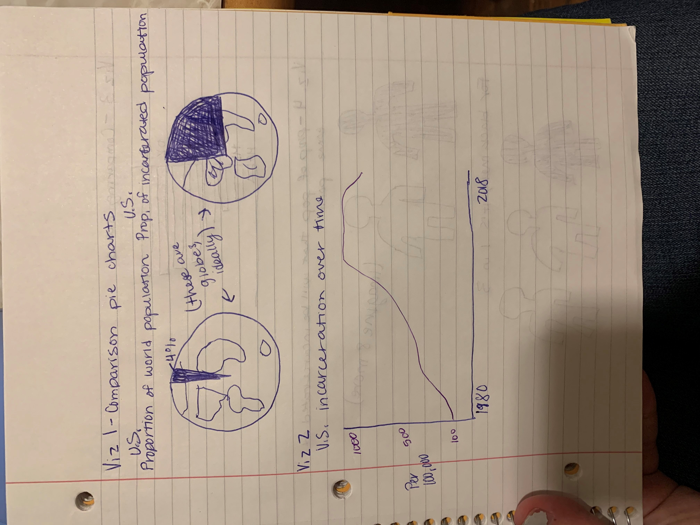
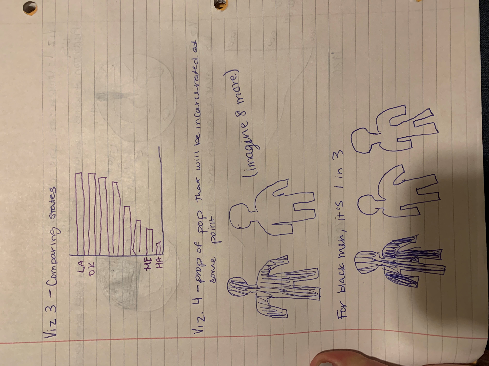
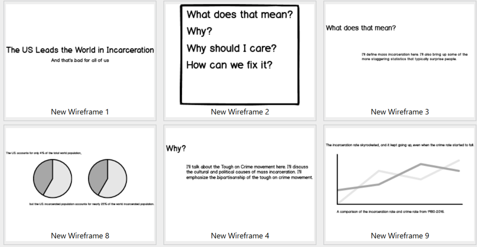
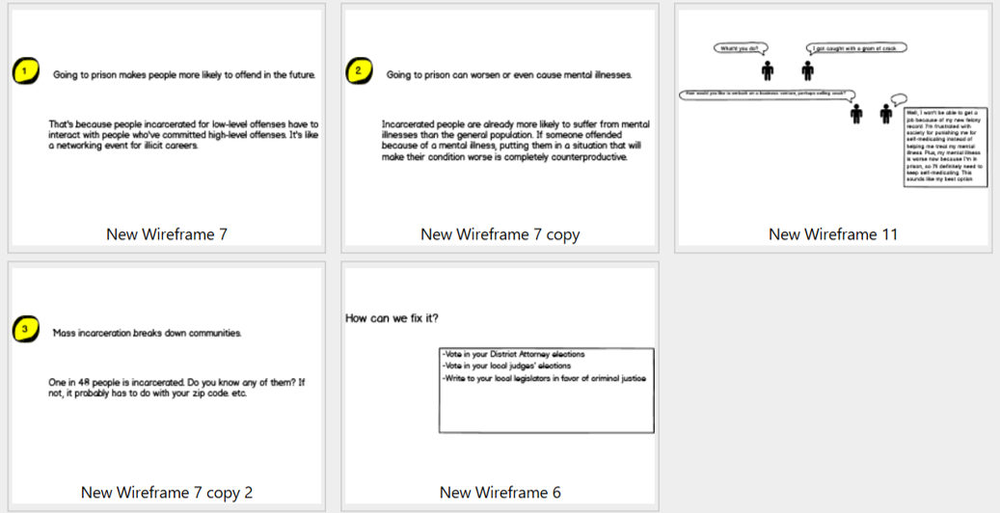

# The U.S. has the highest incarceration rate in the world, and that's a problem for everyone.
Mass incarceration makes you less safe.
# Summary
The U.S. is the most incarcerated country in the world, and that has a negative impact on all of us. There are a lot of myths surrounding criminal justice policy that prevent reform, but in dispelling these myths, reform is possible.
# Outline
Introduction: The United States has the highest incarceration rate in the world. Yes, that's including China and Russia. While the U.S. only accounts for 4% of the world population, our prisons and jails hold almost 25% of the world's incarcerated population (Viz 1). 

# How we got here
We weren't always like this. In fact, we had a pretty normal incarceration rate until the 1980s. American culture became extremely punitive (punishment-oriented) at that time, and experts point to a number of different causes (television, the Civil Rights Movement, rising crime rates). This phenomenon became known as the "tough on crime" movement. The federal goverment started passing laws to criminalize more behaviors and lengthen prison sentences. Most states followed closely behind, creating harsh sentencing laws that exploded the prison population. (I'll talk more about specifics and the timeline here.) - And, mass incarceration isn't really related to crime.

# Where we are now
Even though the federal government was the originator of tough on crime policy, mass incarceration is a state problem (Viz 2). State policy is what drives incarceration, which explains the huge differences in state incarceration rates. Many states have tried to change their criminal justice policies in the last decade. Most of them have had only modest successes. Turns out, it's really hard to change criminal justice policy for a number of reasons. 

# Stuff to keep in mind
1. We believe a lot of myths about who "criminals" are
If you've watched Law and Order, you've probably felt genuine anger and disgust at the show's villains. I'm sure those characters deserved your hatred because they're written that way on purpose. In real life, nobody is a "criminal." Many people break the law everyday; some get caught and most don't. The outcome pretty much depends on your zipcode. 

Let's do an exercise to help you think about this. Think about people you know and love, including yourself. Has anyone you know broken a law without getting caught? Here are some examples to help you brainstorm:
      - Being drunk in public
      - Peeing outside (this one can get you a spot on the sex offender registry!)
      - Giving alcohol to a minor
      - Committing sodomy (Not currently against the law, but there are still people on sex offender registries for this one)
      - Punching someone in the face
      - Smoking, snorting, shooting up X drug (Possession is technically the crime in these cases, but that has less pizzaz)
      
2. "But what about the Ted Bundys of the world?!"

This one's easy. There's a reason you know his name. There's a reason Zac Efron plays him in a movie. There are very few people like Ted Bundy, and he is certainly not representative of all or even most incarcerated people. Plus, no criminal justice reform would ever result in a judge letting a serial killer off with a warning. Criminal justice reform has nothing to do with Ted Bundy.

etc.

# How mass incarceration makes your life worse

# Calls to action
Call your legislators.
Vote for your local district attorney.
Hire people with prior convictions.
Vote for your local judges.
# Data

The bulk of my data are available here: https://www.prisonpolicy.org/data/

PrisonPolicy.org has the biggest (publicly available) collection of organized incarceration data in the country. These data show breakdowns of different incarcerated populations by gender, race, ethnicity, state, type of offense, etc. over time. The over time aspect will be important to show the growth of incarceration during the tough on crime era. 

The breakdown of incarcerated populations by type of offense is, in my opinion, the most salient piece. It will give me the opportunity to explain what different labels like "violent crime" actually mean. I want to take the power out of these labels because they are misleading. 

I will also have a bar chart to show how the US incarceration rate compares to other countries and a chart to show how states compare to each other. The latter helps make the point that incarceration is really a state-level issue. 

# Method and medium

I plan to use Shorthand for this project. I think a simple, clean, linear format fits this topic well. In addition to my data visualizations, I plan to use pictures of people that will evoke a sympathetic reaction and draw viewers in. I need to do more research and look at previous research I've done to make the story cohesive and complete. 

My next step will be sketching additional visualizations to experiment more. As I refine the story I want to tell, I think I'll come up with more creative ideas. Then, I'll get feedback on those images from people who don't know much about the topic. 

# Storyboard

# Getting Feedback

The audience for my presentation is voting-eligible adults who may not know about mass incarceration. A secondary audience would be legislators who haven't spent much time in the policy area. Luckily, most of my friends are voting-eligible adults. Their level of education (Graduate school) is higher than I would like because I want this content to be accessible to everyone. Since they're so busy with school, I will limit my interviews to 5-10 minutes and have them type their answers directly into this repository. That also allows them to critique my work more honestly because they don't have to say anything directly to me. 

Questions:
1. What do you think is the purpose of this presentation?
This is really open-ended. The purpose is to understand how the information comes across. I want to make sure I'm making my point effectively.

2. Who do you think is the target audience for this presentation?
I have a tendency to write for academics, which is a confusing style of communication. I'm asking this question to get feedback on the clarity of my thought process. 

3. What, if anything, did you find confusing in this storyboard?
This question has the same purpose as the previous one but is more open-ended. This way, I'll get feedback on my proposed visuals.

4. What would you change?
This question is an opportunity for my interviewees to say whatever they want about the project. I think this question will give them permission to show me their perspectives.

5. Did this presentation affect your perspective on the topic?
This question is the most important one, to me. The purpose of my presentation is to teach people and change their perspectives, so I want to do that effectively. 

# Interviews

Person 1. Female. 21 years old. CMU graduate student.

1. What do you think is the purpose of this presentation?
I feel like there's more than one purpose. Maybe just to highlight how high the incarceration rate is and how it's not necessarily someone's fault that they're incarcerated.

2. Who do you think is the target audience for this presentation?
 Literally anybody.
 
3. What, if anything, did you find confusing in this storyboard?
I didn't know what the crime rate was or what made it different from the incarceration rate.

4. What would you change?
I would start with the little comic because I think that's a really compelling hook. I also think the different sections should end on concluding notes, so they can transition better. Maybe make the part about mass incarceration tearing down communities the first in the "Why should you care?" section because it connects to the state policy discussion above. 

5. Did this presentation affect your perspective on the topic?
Yeah. It brought things that I hadn't thought about into perspective. Especially the comic. 

Person 2. Female. 22 years old. CMU graduate student.

1. What do you think is the purpose of this presentation?

2. Who do you think is the target audience for this presentation?

3. What, if anything, did you find confusing in this storyboard?

4. What would you change?

5. Did this presentation affect your perspective on the topic?
